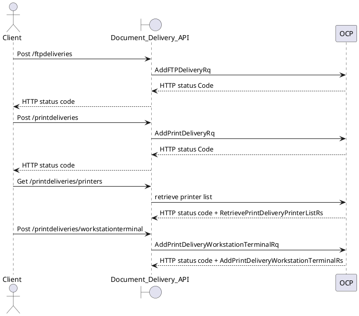

Document Delivery API (OCP) will stores workstation, IP and ACF2 information used by OCP API and send PDF documents either to the OCP Client for printing, using registration table to identify client workstation, or to Momentum for mailbox delivery. 

